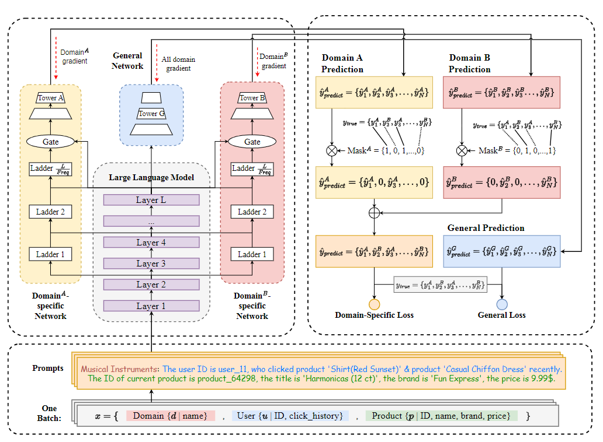
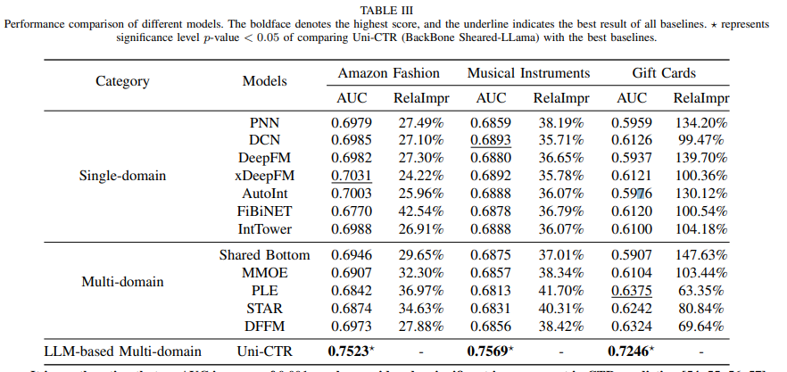

2024 08 25 We are pleased to announce that our paper has been accepted for publication in **TOIS**(CCF-A) (ACM Transactions on Information Systems) 🎉🎉!

# Contents

- [Uni-CTR Description](#uni-ctr-description)
- [Dataset](#dataset)
- [Environment Requirements](#environment-requirements)
- [Quick Start](#quick-start)
- [Script Description](#script-description)
   * [Script and Sample Code](#script-and-sample-code)
   * [Script Parameters](#script-parameters)
      + [Uni-CTR](#uni-ctr)
      + [Multi-Domain Models](#multi-domain-models)
      + [Single-Domain Models](#single-domain-models)
   * [Training Process](#training-process)
      + [Training](#training)
- [Model Description](#model-description)
   * [Performance](#performance)
      + [Training Performance](#training-performance)
      + [Inference Performance](#inference-performance)
- [Description of Random Situation](#description-of-random-situation)

# [Uni-CTR Description](#contents)

The proposed framework for Uni-CTR comprises three parts,. Initially, the input text undergoes processing via the selected **LLM Backbone** to extract the commonalities and distinctions of the data across domains. Subsequently, Subsequently, LLM provides the representations obtained from different layers to the **domain-specific networks** to learn domain-specific characteristics. Additionally, a **general network** is incorporated to learn the representations of all known domains, which enables zero-shot prediction of newly unseen domains.

[A Unified Framework for Multi-Domain CTR Prediction via Large Language Models](https://arxiv.org/abs/2312.10743)




# [Dataset](#contents)

- [Amazon Review Data (2018)](https://cseweb.ucsd.edu/~jmcauley/datasets/amazon_v2/)

# [Environment Requirements](#contents)

- Hardware（GPU）
	- Prepare hardware environment with GPU  processor.
- Framework
	- Pytorch
- Requirements
	- accelerate  
	- huggingface-hub  
	- numpy  
	- peft  
	- scipy  
	- sympy  
	- tensorboard  
	- tokenizers  
	- torch-summary  
	- torchvision  
	- tqdm  
	- transformers  
	- scikit-learn  
	- pandas  
	- tensorflow  
	- matplotlib

# [Quick Start](#contents)

After configuring the environment, you can start training and evaluation as follows:

- running on GPU

  ```python
  # run training and evaluation example
  python training/main.py
  ```

# [Script Description](#contents)

## [Script and Sample Code](#contents)

```bash
.
├── configs                                          # configurations for different paradigm models
│   ├── __init__.py                                  # relative package import
│   ├── config.py                                    # configuration for Uni-CTR
│   ├── config_multi_domain.py                       # configuration for multi-domain baselines
│   └── config_single_domain.py                      # configuration for single-domain baselines
├── layers                                           # network layers in models (mostly from package DeepCTR-torch)
│   ├── __init__.py                                  # relative package import
│   ├── activation.py                                # activation networks
│   ├── core.py                                      # core networks including ladders
│   ├── interaction.py                               # modules for single-domain models
│   ├── sequence.py                                  # sequence processing networks
│   └── utils.py                                     # other data processing methods and additional networks
├── miscellaneous
├── models                                           # all baseline models
│   ├── autoint.py
│   ├── basemodel.py
│   ├── dcn.py
│   ├── deepfm.py
│   ├── fibinet.py
│   ├── mmoe.py
│   ├── ple.py
│   ├── pnn.py
│   ├── sharedbottom.py
│   ├── star.py
│   └── xdeepfm.py
├── preprocessing                                    # data preprocessing
│   ├── amazon_review_data                           # preprocessing methods for Amazon Review Data (2018)
│   │   ├── data_analysis.ipynb                      # analyse the distributions of the domains
│   │   ├── multi_domain_raw_data_processing.py      # data preprocessing for baseline models
│   │   ├── multi_domain_text_processing.py          # prompt generation
│   │   └── one_for_all.py                           # whole dataset preprocessing pipeline for Uni-CTR
│   └── utils.py                                     # data preprocessing methods
├── training                                         # training files
│   ├── main.py                                      # train file for Uni-CTR
│   ├── main_multi_domain.py                         # train file for multi-domain models
│   └── main_single_domain.py                        # train file for single-domain models
├── requirements.txt                                 # package requirements
├── callbacks.py                                     # Early Stopping for single-domain models
├── inputs.py                                        # data transformation
└── utils.py                                         # general functions for Uni-CTR 

```

## [Script Parameters](#contents)

### [Uni-CTR](#contents)

Parameters for Uni-CTR can be set in `configs/config.py`

- Parameters for Amazon Review Data (2018)

```python
text_encoder_models = [  
    # Name, num_hidden_layers, text_embedding_dim, max_length
    ["Llama-2-7b-hf", 24, 2048, 4096],  
]
text_encoder_model_name, layer_num, text_embedding_dim, max_length = text_encoder_models[0]
ladder_frequency = 4

ladder_block = ["wo_block", "w_lora", "w_self_attention", "w_transformer_block"]  
ladder_block = ladder_block[3]  
r = 4  
num_heads = 2  
narrowed_ratio = 0.25  
use_peft = True
mixed_precision = True
dropout = 0.2
epochs = 10
batch_size = 3 * len(device_ids)
seed = 2012
lr = 8e-5  
max_lr = 5e-4
weight_decay = 0.001
```

### [Multi-Domain Models](#contents)

Parameters for multi-domain can be set in `configs/config_multi_domain.py`

- Parameters for Amazon Review Data (2018)

```python
multiplier = 6
embed_dim = 32
dropout = 0.2  
epochs = 10  
batch_size = 2048  
seed = 2012  
lr = 1e-7  
max_lr = 1e-3
weight_decay = 0.002
```


### [Single-Domain Models](#contents)

Parameters for multi-domain can be set in `configs/config_single_domain.py`

- Parameters for Amazon Review Data (2018)

```python
embed_dim = 32
epoch = 10
batch_size = 2048
seed = 2012
lr = 1e-7  
max_lr = 1e-3
weight_decay = 0.002
```

## [Training Process](#contents)

### Training

- running on GPUs with `DistributedDataParallel`

  - Start training:
    ```shell
    tmux new -s my_session	# (Optional)
    cd multi-domain
    CUDA_VISIBLE_DEVICES=0,1 nohup torchrun --nproc_per_node=2 training/main.py > output.log 2>&1 &
    ```
    
  - Press the following keys to detach from session `my_session`:
    
    <kbd>Ctrl</kbd> + <kbd>B</kbd> + <kbd>D</kbd>
  	
  - Use the following code to attach session `my_session`:
    ```shell
    tmux attach-session -t my_session
    ```


- The python command above will run in the background, you can view the results through the file `ms_log/output.log`.

  ```txt
   13%|█▎        | 31/14524 [06:23<36:26:32,  1.36it/s, train_auc=0.713, train_loss=0.47034054]
   ...
  ```

- The model checkpoint will be saved in the current directory.

# [Model Description](#contents)

## [Performance](#contents)

### Training Performance

| Parameters          | GPU                                                    |
| ------------------- | ------------------------------------------------------ |
| Model Version       | Uni-CTR                                                |
| Resource            | GPU 8$\times$NVIDIA V100 32G                           |
| Uploaded Date       | 12/09/2023 (month/day/year)                            |
| Pytorch Version     | 2.0.1                                                  |
| Dataset             | [1]                                                    |
| Domains             | [0,2,3]                                                |
| Training Parameters | epoch=10, batch_size=3$\times$len(device_ids), lr=1e-4 |
| Optimizer           | AdamW                                                  |
| Loss Function       | Sigmoid Cross Entropy With Logits                      |
| outputs             | AUC                                                    |
| Loss                |                                                        |
| Per Step Time       | ms                                                     |

### Inference Performance

| Parameters      | GPU                           |
| --------------- | ----------------------------- |
| Model Version   | Uni-CTR                       |
| Resource        | GPU 8$\times$NVIDIA V100 32G |
| Uploaded Date   | 12/09/2023 (month/day/year)   |
| Pytorch Version | 2.0.1                         |
| Dataset         | [1]                           |
| Domains         | [0,2,3]                       |
| batch_size      | 150$\times$len(device_ids)                           |
| outputs         | AUC                           |
| AUC             | [0.7523, 0.7569, 0.7246]       |


# [Description of Random Situation](#contents)

We set the random seed before training in model_config.py.
